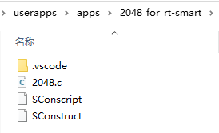

将 2048 放在 userapps\apps 目录下：

按照 [移植示例的 5. 步骤](https://www.rt-thread.org/document/site/#/rt-thread-version/rt-thread-smart/application-note/port-app/port-app) 完成 2048 的移植和运行：

- 在 userapps 下设置工具链：使用命令 `smart-env.bat arm` 设置工具链路径。
- 在 userapps 下编译：userapps 下执行 `scons`，生成 2048.elf。
- 打包 sd.bin：将 2048.elf 打包进 sd.bin，将 sd.bin 放在 rt-thread\bsp\qemu-vexpress-a9 目录下（rt-smart 分支）。
- QEMU 模拟运行：在 rt-thread\bsp\qemu-vexpress-a9 目录下，终端输入 `qemu.bat`，smart 运行起来之后，再输入 `mnt/bin/2048.elf` 运行 2048 应用。

注意：这只是一个教你动手的移植 linux 应用的的教程，教程步骤适用于移植其他应用。如果你仅仅是想使用或体验 2048 小游戏，建议直接使用 [2048 游戏软件包](https://github.com/mysterywolf/c2048)，不用移植，在 Env 中打开下载该软件包即可在 Smart 上使用。

